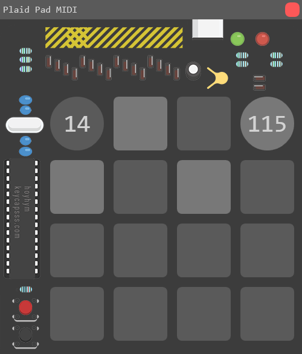

# Plaid Pad MIDI

This software will allow you to use MIDI functionality on your Plaid Pad through raw HID communcation and a virtual MIDI device.

## Usage
If you're very familiar with QMK this should be enough: [My Keymap](https://github.com/mavanmanen/qmk_firmware/tree/master/keyboards/keycapsss/plaid_pad/keymaps/mavanmanen)

If not, please follow these steps:
1. Download [hid-midi.c](https://raw.githubusercontent.com/mavanmanen/qmk_firmware/master/keyboards/keycapsss/plaid_pad/keymaps/mavanmanen/hid-midi.c) and [hid-midi.h](https://raw.githubusercontent.com/mavanmanen/qmk_firmware/master/keyboards/keycapsss/plaid_pad/keymaps/mavanmanen/hid-midi.h).
2. Place these files in your Plaid Pad keymap folder.
3. In your keymap's `rules.mk` add `RAW_ENABLE = yes` and `SRC += hid-midi.c`.
4. In your `keymap.c` add the following things:
   - `#include "hid-midi.h"` at the top.
   - `MIDI_LAYER` at the bottom of your layers.
   - `if(process_midi_button(keycode, record)) return false;` At the top of your `process_record_user` function.
   - `process_midi_encoder(index, ccw);` at the top of your `encoder_update_user` function.

Alternatively you could also download my entire keymap and just edit to your liking.

In `hid-midi.c` you'll also be able to set the buttons to either momentary or toggle.

## Requirements
This application requires you have installed the following:
1. [VirtualMIDI](http://www.tobias-erichsen.de/software/virtualmidi.html)
2. [LoopMIDI](http://www.tobias-erichsen.de/software/loopmidi.html)
   - Only needs to be installed, doesn't need to be running for the application to function.

## Limitations 
Due to V-USB having a limited amount of endpoints, any QMK features that open endpoints besides the default one will need to be turned off.

## Credits
The Plaid Pad was created by BenRoe ([GitHub](https://github.com/BenRoe) / [Twitter](https://twitter.com/keycapsss)).
[Buy yours here!](https://keycapsss.com/diy-kits/104/plaid-pad-4x4-numpad)

The art used for the background of the application and the logo is made by [hoyhym](https://hoyhym.be).

VirtualMIDI, LoopMIDI and the SDK was created by [Tobias Erichsen](https://tobias-erichsen.de/).